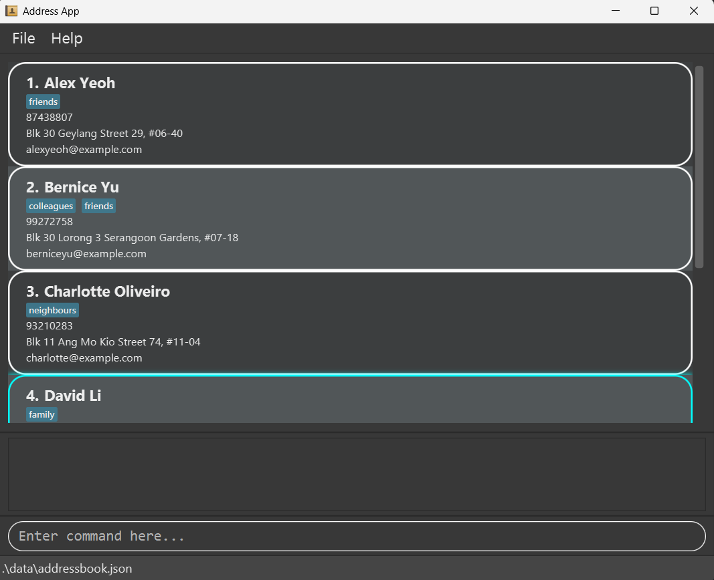
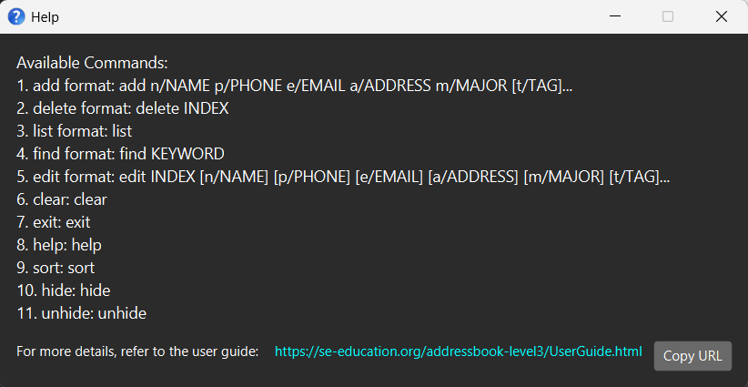
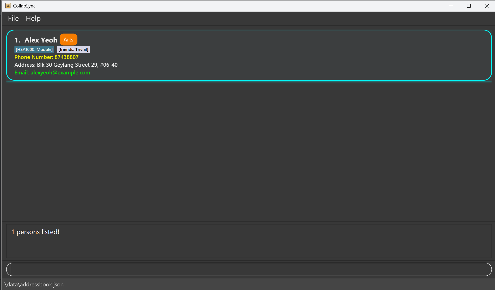
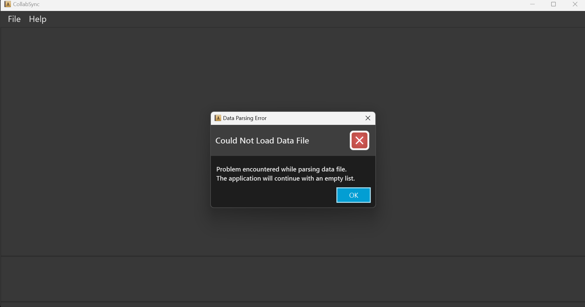
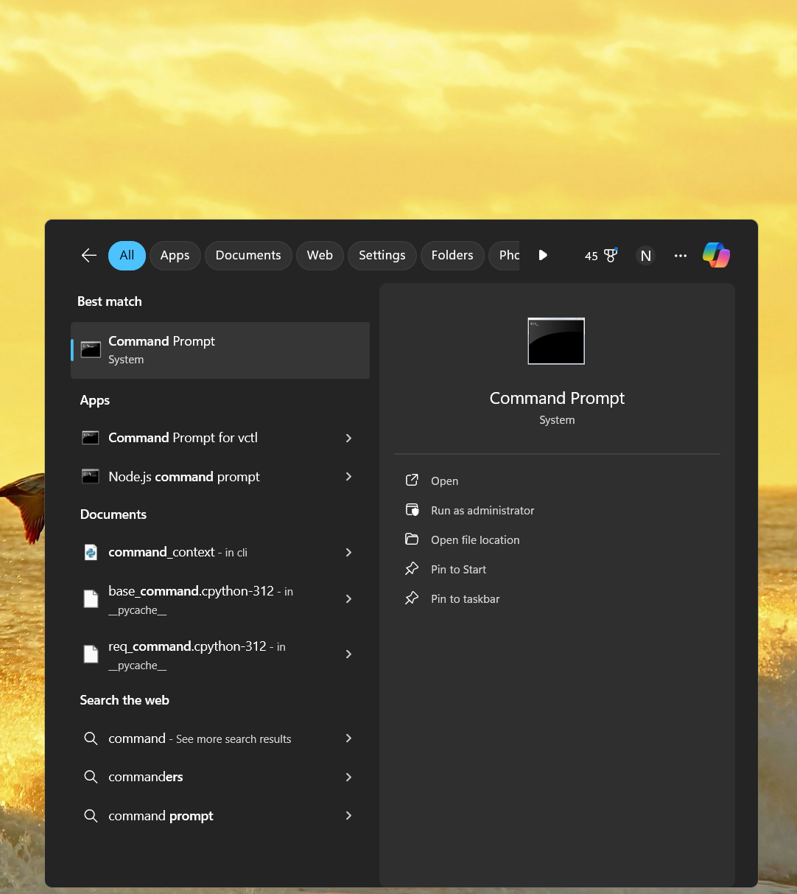
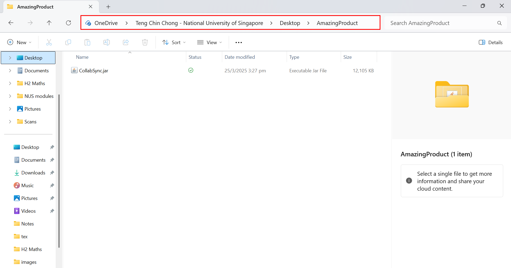

# CollabSync User Guide

CollabSync is a **desktop app for university students to help manage contacts swiftly and effectively**,
optimized for use via a Command Line Interface (CLI) while still having the benefits of a
Graphical User Interface (GUI). If you can type fast, CollabSync can get your contact management tasks done
faster than traditional GUI apps.

---

## 📚 Guide Directory

This User Guide is structured to help you quickly set up and use **CollabSync** effectively:

- **[Quick Start](#quick-start)**  🚀  
  *Recommended for first-time users.*  
  Step-by-step instructions to get CollabSync running in minutes.

- **[Table of Contents](#table-of-contents)**  📖
  *Quickly navigate to any section.*  
  Jump directly to features, commands, or FAQs.

- **[Features](#features)**  💡 
  *Explore commands in detail.*  
  Learn how to use each command with syntax, examples, and best practices.

- **[FAQ](#faq)**  ❓
  *Have a question? Start here.*  
  Answers to common usage and installation queries.

- **[Known Issues](#known-issues)**   ⚠️
  *Troubleshooting help.*  
  Lists current bugs and suggested workarounds.

- **[Command Summary](#command-summary)**  📝
  *Perfect for quick reference.*  
  A brief overview of all commands syntax and formats.

- **[Miscellaneous Information](#miscellaneous-information)**  📌  
  *Setup notes & definitions.*  
  Additional setup tips and glossary of important terms.


### Understanding these Callout Boxes

Throughout this guide, you'll encounter different types of callout boxes that provide important information:

<div markdown="1" class="alert alert-info">

:information_source: **Info Box**

Provides additional information or clarifications about a feature or command in CollabSync.

</div>


<div markdown="1" class="alert alert-success">

:bulb: **Tip Box**

Offers helpful tips to boost productivity. These tips allow you to navigate CollabSync more effectively.

</div>

<div markdown="1" class="alert alert-warning">

:warning: **Warning Box**

Highlights important warnings or potential issues. Pay extra attention to these warnings to avoid problems.

</div>

<div markdown="1" class="alert alert-danger">

:exclamation: **Danger Box**

Indicates critical warnings or irreversible actions. Always read these carefully before proceeding to the next step.

</div>


---

## 📖 Table of Contents
1. [Quick Start](#quick-start)
2. [Features](#features)
    - [View Help Window](#view-help-window)
    - [Add a Student](#add-a-student)
    - [List All Students](#list-all-students)
    - [Hide Information](#hide-information)
    - [Unhide Information](#unhide-information)
    - [Sort Contacts](#sort-contacts)
    - [Edit a Student's Contact](#edit-a-student-s-contact)
    - [Find Student(s)](#find-student-s)
    - [Delete Contact(s)](#delete-contact-s)
    - [Clear All Contacts](#clear-all-contacts)
    - [Data Management](#data-management)
    - [Exit the Program](#exit-the-program)
3. [FAQ](#faq)
4. [Known Issues](#known-issues)
5. [Command Summary](#command-summary)
6. [Miscellaneous Information](#miscellaneous-information)
    - [Additional Guides for Setup](#additional-guides-for-setup)
    - [Glossary](#glossary)

---

## 🚀 Quick Start

1. Ensure `Java 17` or above is installed on your computer.
    - If you're unsure whether Java is installed or need installation instructions, click [here](#faq).
    - **For Mac users:** Install the exact JDK version specified [here](https://se-education.org/guides/tutorials/javaInstallationMac.html).

2. Download the latest `.jar` file from [here](https://github.com/AY2425S2-CS2103T-F10-3/tp/releases).

3. Copy the file to the folder you want to use as the _home folder_ for your CollabSync. Click [here](#additional-guides-for-setup) if you wish to see a pictorial illustration.

4. Open a command terminal, `cd` into the folder you put the jar file in, and use the `java -jar CollabSync.jar` command to run the application.  
   A GUI similar to the below should appear in a few seconds. Note how the app contains some sample data.  
   

5. Type the command in the command box and press Enter to execute it. For example, typing **`help`** and pressing Enter will open the help window.  
   Some example commands you can try:
    - `list`: Lists all contacts.
    - `add n/John Doe p/98765432 e/johnd@example.com a/John street, block 123, #01-01 m/Physics`: Adds a contact named `John Doe` to the Address Book.
    - `delete 3`: Deletes the 3rd contact shown in the current list.
    - `clear`: Deletes all contacts.
    - `exit`: Exits the app.

6. Refer to the [Features](#features) below for details of each command.

---

# 💡 Features

<div markdown="1" class="alert alert-info">

:information_source: **Info**

**Notes about the command format:**
- Words in `UPPER_CASE` are the parameters to be supplied by the user.  
  e.g. in `add n/NAME`, `NAME` is a parameter which can be used as `add n/John Doe`.

- Items in square brackets are optional.  
  e.g. `n/NAME [t/TAG]` can be used as `n/John Doe t/friend` or as `n/John Doe`.

- For the tags, we denote tag as `TAG` , where `TAG` is represented as either `TAGNAME` / `TAGNAME:` , tags with no priority or `TAGNAME:PRIORITY` , which corresponds to the 
  tags associated with priority. This syntax would be highly useful when using add/delete/edit with respect to the tags. `TAGNAME` is the description of the tag while `PRIORITY` has 3 levels : **Urgent** , **Trivial** , **Module**.

- Items inside normal brackets means that it is an 'either or' option.  
  e.g. `delete (INDEX | t/TAGS)` means we can either delete by index or by tag.  
  So the delete format can either be `delete INDEX` or `delete t/TAGS`.

- Items with `…`​ after them can be used multiple times including zero times.  
  e.g. `[t/TAG]…​` can be used as ` ` (i.e. 0 times), `t/friend`, `t/friend t/family` etc.

- Parameters can be in any order.  
  e.g. if the command specifies `n/NAME p/PHONE_NUMBER`, `p/PHONE_NUMBER n/NAME` is also acceptable.

- Extraneous parameters for commands that do not take in parameters (such as `help`, `list`, `exit` and `clear`) will be ignored.  
  e.g. if the command specifies `help 123`, it will be interpreted as `help`.

- If you are using a PDF version of this document, be careful when copying and pasting commands that span multiple lines as space characters surrounding line-breaks may be omitted when copied over to the application.

</div>

---

## View Help Window
* List out all commands featured in CollabSync.
* Format: `help`

<div markdown="1" class="alert alert-info">

:information_source: **Info**

Shows a help window with the basic commands needed for basic usage of CollabSync.

</div>



<br>
<br>

--- 

## Add a Student
* Adds a student to the address book.
* Format: `add n/NAME p/PHONE_NUMBER e/EMAIL a/ADDRESS m/MAJOR [t/TAG]…​`

<div markdown="1" class="alert alert-success">

:bulb: **Tip**

- A student can have any number of tags (You can choose to omit tags).
- Tags added in also have priority: Module, Trivial, Urgent or no priority at all.

</div>

<div markdown="1" class="alert alert-success">

:bulb: **Note**

- Unfortunately, we do not allow names that contains special characters. (E.g : Bala Gopal S/O)
- As such, we highly recommend students to simply replace these special characters with spacing. (E.g : Bala Gopal S O)

</div>

### Examples:

* `add n/Alex Albon p/98765432 e/Alex@example.com a/Alex street, block 123, #01-01 m/Computer Science t/CS2100`  
  → Adds a student named **Alex Albon** with contact details and one tag: `CS2100` (a module).

* `add n/Bax Berstappen p/87654321 e/Bax@example.com a/Newgate Prison m/Maths t/CS2100 t/MA1521 t/CS2103T t/AX1234`  
  → Adds a student named **Bax Berstappen** majoring in Maths, with four module tags. Useful when a student is involved in many courses.

* `add n/Carloz Cainz p/85580001 e/Carloz@example.com a/Carloz stree m/History`  
  → Adds **Carloz Cainz** with no tags. Tags are optional — this is a valid minimal command with all required fields.

<br>
<br>


---

## List All Students
* Shows a list of all students in CollabSync.
* Format: `list`

<div markdown="1" class="alert alert-success">

:bulb: **Note**

You do not need to enter anything else behind `list`.

</div>

<br>
<br>

---

## Hide Information
* Hides all attributes about all contacts currently listed in the window, except for the name and tags (if it was shown in the first place)
* Format: `hide`

<div markdown="1" class="alert alert-success">

:bulb: **Note**

- If the contact list was already hidden, then running `hide` again will not change the contact card.
- Running `hide` on the current window only hides the contacts' attributes **in this window**, and not all the contacts in the address book.

</div>


<br>
<br>

---

## Unhide Information
* Unhides all information, uncovering all attributes (if it was shown in the first place)
* Format: `unhide`

<div markdown="1" class="alert alert-success">

:bulb: **Note**

- If the contact list was already displayed, then running `unhide` again will not change the contact card.
- Running `unhide` on the current window only reveals the contacts' attributes **in this window**, and not all the contacts in the address book.

</div>


<br>
<br>

---

## Sort Contacts
* Sorts the contact list in ascending or descending order based on name and phone number.
* Format: `sort (asc | desc)`
* For a comprehensive, complete description of the format, refer to the 2 acceptable formats below.
    - `sort asc ` : to sort persons in ascending order by name, followed by phone number.
    - `sort desc` : to sort persons in descending order by name, followed by phone number.

<div markdown="1" class="alert alert-info">

:information_source: **Info**

- Sorts all contacts in the displayed list.
- The sorting is primarily by name (alphabetical order).
- If names are identical, sorting will be based on phone numbers.
- The `ORDER` parameter must be either:
- `asc` → Sorts the list in ascending order (A → Z).
- `desc` → Sorts the list in descending order (Z → A).

If the contact list is empty, the command will notify you that there are no contacts to sort.

Sorting does not modify existing contact details.

</div>


### Examples:
*  `sort asc`
   → Sorts the contact list in ascending order by name, followed by phone number.
*  `sort desc`
   → Sorts the contact list in descending order by name, followed by phone number.

<br>
<br>

---

## Edit a Student's Contact
* Edits an existing student in the address book.
* Format: `edit INDEX [n/NAME] [p/PHONE] [e/EMAIL] [a/ADDRESS] [m/MAJOR] [t/TAG]…​`


<div markdown="1" class="alert alert-info">

:information_source: **Info**

- Edits the student at the specified `INDEX`. The index refers to the index number shown in the displayed person list. The index **must be a positive integer** 1, 2, 3, …
- At least one of the optional fields must be provided.
- Existing values will be updated to the input values.
- When editing tags, `priority` of the existing tags can also be changed.
- When editing tags, the existing tags of the student will be removed i.e., adding of tags is not cumulative.
- You can remove all the student’s tags by typing `t/` without specifying any tags after it.

</div>


### Examples:
*  `edit 1 p/91234567 e/johndoe@example.com` Edits the phone number and email address of the 1st student to be `91234567` and `johndoe@example.com` respectively.
*  `edit 2 n/Betsy Crower t/` Edits the name of the 2nd student to be `Betsy Crower` and clears all existing tags.

<br>
<br>

---

## Find Student(s)
* Finds students whose names contain any of the given keywords.
* Format: `find KEYWORD [MORE_KEYWORDS]`

<div markdown="1" class="alert alert-info">

:information_source: **Info**

- The search is case-insensitive. e.g. `hans` will match `Hans`
- The order of the keywords does not matter. e.g. `Hans Bo` will match `Bo Hans`
- Only full words will be matched e.g. `Han` will not match `Hans`
- Persons matching at least one keyword will be returned (i.e. `OR` search).  
  e.g. `Hans Bo` will return `Hans Gruber`, `Bo Yang`
- The search can also look up other attributes, such as phone numbers and email addresses, to find a particular student.
- For search using tags, only the `tagname` & `priority (if any)` can be used.  
  (i.e. When a person named `John Smith` is added with tag `t/CS2100:Module`, we can search for `John Smith` using the tagname: `CS2100` or priority: `Module`)

</div>


<div markdown="1" class="alert alert-danger">

:warning: **Caution**

- This feature only works for **name, contact number, email, tags**
- To find based on tags, please only enter the **tagname** or **priority** of the tag. Below is an illustration of this example
  

From the image, to find **Alex Yeoh**, whose tag has its tagname : `HSA1000` and its priority : `Module` , use either `find HSA1000` or `find module`. Do not use `find HSA1000:Module`.

</div>


### Examples:
* `find John` returns `john` and `John Doe`
* `find alex david` returns `Alex Yeoh`, `David Li`<br>
  

<br>
<br>

--- 

## Delete Contact(s)
* Deletes the specified student from the currently displayed list.
* Format: `delete (INDEX | t/TAG [ ,t/TAGS])` , where `TAG` is `TAGNAME:PRIORITY`
* For a comprehensive, complete description of the format, refer to the 5 acceptable formats below.
  - `delete INDEX ` : to delete a contact by index.
  - `delete t/TAGNAME` : to delete any contacts who have tags that correspond to the tagname, with no priority given.
  - `delete t/TAGNAME:trivial` : to delete any contacts who have tags that correspond to the tagname, and with the **trivial** priority.
  - `delete t/TAGNAME:module` : to delete any contacts whose have tags that correspond to the tagname, and with the **module** priority.
  - `delete t/TAGNAME:urgent` : to delete any contacts whose tags that correspond to the tagname, and with the **urgent** priority. 

<div markdown="1" class="alert alert-info">

:information_source: **Info**

- Deletes the student(s) at the specified `INDEX` or with the specified `TAGS`.

### Index
- The index refers to the index number shown in the displayed student list.
- The index **must be a positive integer** 1, 2, 3, …

### Tags
- The tags refer to the tags associated with a contact.
- There must be at least 1 tag inside the parameter.
- For any tags with priority, please delete them by **including the priority (if any)**.

</div>


<div markdown="1" class="alert alert-success">

:bulb: **Note**

- This operates on whatever contacts are currently shown, which may be a filtered subset of all contacts if you've used commands like `find` beforehand.
- We use a dedicated confirmation feature to ensure users deliberately approve deletion, reducing the risk of accidental data loss. While typing is convenient and favored by many students, it can also lead to unintentional actions. This extra step acts as an essential safeguard against mistakes.

</div>


### Examples:
* `list` followed by `delete 2` deletes the 2nd student in the address book.
* `find Betsy` followed by `delete 1` deletes the 1st student in the results of the `find` command.
* `list` followed by `delete t/CS2100` removes all contacts with tags `CS2100`.
* `find Andrew` followed by `delete t/CS2100` removes all contacts with the name `Andrew` and tag `CS2100`.

<br>
<br>

---

## Clear All Contacts
* Clears all entries from the address book.
* Format: `clear`

<br>
<br>

---

## Data Management

### Saving the data

* CollabSync data are saved in the hard disk automatically after any command that changes the data. There is no need to save manually.

### Editing the data file

* CollabSync data are saved automatically as a JSON file `[JAR file location]/data/addressbook.json`. Advanced users are welcome to update data directly by editing that data file.

<div markdown="1" class="alert alert-danger">

:warning: **Caution**

- If your changes to the data file make its format invalid, CollabSync will start with an empty data file at the next run. A warning prompt will also appear on your next CollabSync startup.



- Your existing data file will be automatically backed up at `/data/addressbook_old.json`.

- Furthermore, certain edits can cause CollabSync to behave in unexpected ways (e.g., if a value entered is outside the acceptable range). Therefore, edit the data file only if you are confident that you can update it correctly.

</div>

<br>
<br>

---

## Exit the Program
* Exits and stops the program for the User.
* Format: `exit`

<br>
<br>

---

## ❓ FAQ

**Q**: How do I check my Java Version?<br>
**A**: Follow these steps: <br>
1. Open the Start button and find the command prompt using the search button. <br>
   
2. Run `java -version` inside the terminal.
```{highlight-lines="1['java -version']"}
foo@bar:~$ java -version
java version "17.0.12" 2024-07-16 LTS
Java(TM) SE Runtime Environment (build 17.0.12+8-LTS-286)
Java HotSpot(TM) 64-Bit Server VM (build 17.0.12+8-LTS-286, mixed mode, sharing)
```

**Q**: How to install Java-17?<br>
**A**: Follow the guide [here](https://www3.cs.stonybrook.edu/~amione/CSE114_Course/materials/resources/InstallingJava17.pdf).

**Q**: How do I transfer my data to another Computer?<br>
**A**: Install the app in the other computer and overwrite the empty data file it creates with the file that contains the data of your previous CollabSync home folder.

**Q**: Will the backup file be overwritten?<br>
**A**: Yes, if a backup exists and the data corrupts again, the old backup will be overwritten.

-----------------------------------------------------------------------------------------------------------------------

## ⚠️ Known Issues

1. **When using multiple screens**, if you move the application to a secondary screen, and later switch to using only the primary screen, the GUI will open off-screen. The remedy is to delete the `preferences.json` file created by the application before running the application again.
2. **If you minimize the Help Window** and then run the `help` command (or use the `Help` menu, or the keyboard shortcut `F1`) again, the original Help Window will remain minimized, and no new Help Window will appear. The remedy is to manually restore the minimized Help Window.
   <br>
   <br>

-----------------------------------------------------------------------------------------------------------------------

## 📝 Command Summary

| **Action** | **Format**                                                                       | **Examples**                                                                                             |
|------------|----------------------------------------------------------------------------------|----------------------------------------------------------------------------------------------------------|
| **Add**    | `add n/NAME p/PHONE_NUMBER e/EMAIL a/ADDRESS m/MAJOR [t/TAG]…​`                  | `add n/James Ho p/22224444 e/jamesho@example.com a/123, Clementi Rd, 1234665 m/DSA t/friend t/colleague` |
| **Clear**  | `clear`                                                                          | -                                                                                                        |
| **Delete** | `delete (INDEX \| t/TAGS)`                                                       | `delete 3`, `delete t/CS2100`                                                                            |
| **Edit**   | `edit INDEX [n/NAME] [p/PHONE_NUMBER] [e/EMAIL] [a/ADDRESS] [m/MAJOR] [t/TAG]…​` | `edit 2 n/James Lee e/jameslee@example.com`                                                              |
| **Sort**   | `sort (asc \| desc)`                                                             | `sort asc`, `sort desc`                                                                                  |
| **Find**   | `find KEYWORD [MORE_KEYWORDS]`                                                   | `find James Jake tyrone@example.com`                                                                     |
| **List**   | `list`                                                                           | -                                                                                                        |
| **Hide**   | `hide`                                                                           | -                                                                                                        |
| **Unhide** | `unhide`                                                                         | -                                                                                                        |
| **Help**   | `help`                                                                           | -                                                                                                        |
| **Exit**   | `exit`                                                                           | -                                                                                                        |

---

## 📌 Miscellaneous information

---

### Additional Guides for Setup

1. Copy the file to the folder you want to use as the _home folder_ for your CollabSync.
    * 1.a. _home folder_ used for this example is `AmazingProduct` , as seen from the image below.
    * 1.b. `CollabSync.jar` is in the `AmazingProduct` folder, as seen from the image below too.



2. From the image above, click the red-highlighted box. For this example, the rectangular box contains `OneDrive > Teng .... > Desktop > AmazingProduct `

3. Then, copy it. This would be the **file path** (the path to the `CollabSync.jar` file)

4. Open your command prompt, type `cd <file_path>` (without the "<" and ">"). Then press `enter`/`return`. Refer to the image below step 5 for your reference.

5. Lastly, type `java -jar CollabSync.jar` on your command terminal. And that's it! You should be able to access the exciting features of CollabSync!
```{highlight-lines="1['cd \"C:\Users\tengc\OneDrive - National University of Singapore\Desktop\AmazingProduct\"'], 2['java -jar CollabSync.jar']"}
foo@bar:~$ cd "C:\Users\tengc\OneDrive - National University of Singapore\Desktop\AmazingProduct"
foo@bar:~$ java -jar CollabSync.jar
...
```

---

### Glossary

| **Terminology**                       | **Definition**                                                                                                                                                                                            |
|---------------------------------------|-----------------------------------------------------------------------------------------------------------------------------------------------------------------------------------------------------------|
| **CLI (Command Line Interface)**      | A way to interact with CollabSync by typing commands into a text-based terminal.                                                                                                                          |
| **GUI (Graphical User Interface)**    | A visual interface that lets you interact with CollabSync using windows, buttons, and icons.                                                                                                              |
| **Command**                           | An instruction typed into the CLI to perform a specific task in CollabSync (e.g. `add`, `delete`).                                                                                                        |
| **Tag**                               | A keyword or label that can be attached to a contact (e.g. `CS2100`, `urgent`) for organization and filtering.                                                                                            |
| **Major**                             | The primary academic discipline (e.g. Computer Science, History) assigned to a student contact.                                                                                                           |
| **Module**                            | A specific university course (e.g. CS2100, MA1521) which can be added as a tag.                                                                                                                           |
| **Trivial**                           | Any fun fact or trivial/unimportant fact about the person (e.g. family, buddy) which can be added as a tag.                                                                                               |
| **Index**                             | The number assigned to a contact in the current list view (starts from 1). Used in commands like `edit 1`.                                                                                                |
| **Home Folder**                       | The folder where the `CollabSync.jar` file and its associated data files are stored.                                                                                                                      |
| **.jar File**                         | A Java Archive file that contains the compiled Java code needed to run CollabSync application.                                                                                                            |
| **JSON File**                         | The file format (`addressbook.json`) used by CollabSync to store your data persistently.                                                                                                                  |
| **JDK (Java Development Kit)**        | A software development environment used for developing Java applications that includes the JRE, an interpreter/loader, a compiler, and other tools needed for Java development.                           |
| **Tag Priority**                      | A classification system for tags that determines their importance level. Available priorities include Module, Trivial, Urgent, or no priority. Priority affects how contacts are organized and displayed. |
| **Contact Card**                      | The visual representation of a student's contact information in the application interface, displaying details such as name, phone number, email address, and tags.                                        |
| **Parameter**                         | A specific piece of information provided to a command, typically indicated by a prefix (e.g., n/ for name, p/ for phone number) followed by the actual value.                                             |
| **Attributes**                        | The specific pieces of information associated with a contact, such as name, phone number, email address, physical address, and major.                                                                     |
| **Command Box**                       | The text input field at the bottom of the CollabSync window where users type commands to interact with the application.                                                                                   |
| **Cumulative (in context of tags)**   | The property of adding to existing values rather than replacing them. In CollabSync, tag editing is not cumulative, meaning new tags replace all existing tags rather than being added to them.           | 
| **Command Syntax**                    | The structure that a command must follow to be valid (e.g. required parameters, format).                                                                                                                  |

---

