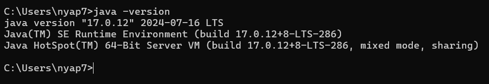
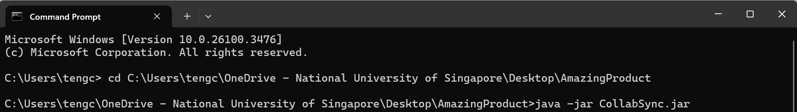

# CollabSync User Guide

CollabSync is a **desktop app for university students to help manage contacts swiftly and effectively, optimized for use via a Line Interface** (CLI) while still having the benefits of a Graphical User Interface (GUI). If you can type fast, CollabSync can get your contact management tasks done faster than traditional GUI apps.

<!-- * Table of Contents -->
## Quick Search
1. [Quick Start](#quick-start)
2. [Features](#features)
    - [Help](#feature-1-help)
    - [Adding a student](#feature-2-adding-a-student)
    - [Listing all students](#feature-3-listing-everyone-in-contact)
    - [Hide information](#feature-4-hide-information)
    - [Unhide information](#feature-5-unhide-information)
    - [Editing a student's contact](#feature-6-editing-a-contact)
    - [Finding a student](#feature-7-find-student)
    - [Deleting a student's contact](#feature-8-delete-a-contact)
    - [Clearing all contacts](#feature-9-clear)
    - [Data management](#feature-10-data-management)
    - [Exit](#feature-11-exit)
3. [FAQ](#faq)
4. [Known Issues](#known-issues)
5. [Command Summary](#command-summary)

--------------------------------------------------------------------------------------------------------------------

## Quick start

1. Ensure you have Java `17` or above installed in your Computer. 
   1.a. To check, click [here](#faq). 
   1.b. **Mac users:** Ensure you have the precise JDK version prescribed [here](https://se-education.org/guides/tutorials/javaInstallationMac.html).

2. Download the latest `.jar` file from [here](https://github.com/AY2425S2-CS2103T-F10-3/tp/releases/tag/v1.3).

3. Copy the file to the folder you want to use as the _home folder_ for your CollabSync. Click [here](#additional-guides-for-setup) if you wish to see a pictorial illustration.

4. Open a command terminal, `cd` into the folder you put the jar file in, and use the `java -jar CollabSync.jar` command to run the application. 
   A GUI similar to the below should appear in a few seconds. Note how the app contains some sample data. 
   

5. Type the command in the command box and press Enter to execute it. e.g. typing **`help`** and pressing Enter will open the help window. 
   Some example commands you can try:

    * `list` : Lists all contacts.

    * `add n/John Doe p/98765432 e/johnd@example.com a/John street, block 123, #01-01 m/Physics` : Adds a contact named `John Doe` to the Address Book.

    * `delete 3` : Deletes the 3rd contact shown in the current list.

    * `clear` : Deletes all contacts.

    * `exit` : Exits the app.

6. Refer to the [Features](#features) below for details of each command.

--------------------------------------------------------------------------------------------------------------------

# Features

<box type="info" seamless>

**Notes about the command format:** 

* Words in `UPPER_CASE` are the parameters to be supplied by the user. 
  e.g. in `add n/NAME`, `NAME` is a parameter which can be used as `add n/John Doe`.

* Items in square brackets are optional. 
  e.g `n/NAME [t/TAG]` can be used as `n/John Doe t/friend` or as `n/John Doe`.

* Items inside normal brackets means that it is an 'either or' option.  
  e.g. `delete (INDEX | t/TAGS)` means we can either delete by index or by tag.   
  So delete format can either be `delete INDEX` or `delete t/TAGS`.

* Items with `…`​ after them can be used multiple times including zero times. 
  e.g. `[t/TAG]…​` can be used as ` ` (i.e. 0 times), `t/friend`, `t/friend t/family` etc.

* Parameters can be in any order. 
  e.g. if the command specifies `n/NAME p/PHONE_NUMBER`, `p/PHONE_NUMBER n/NAME` is also acceptable.

* Extraneous parameters for commands that do not take in parameters (such as `help`, `list`, `exit` and `clear`) will be ignored. 
  e.g. if the command specifies `help 123`, it will be interpreted as `help`.

* If you are using a PDF version of this document, be careful when copying and pasting commands that span multiple lines as space characters surrounding line-breaks may be omitted when copied over to the application.
  </box>

-----------------------------------------------------------------------------------------------------------------------

# Feature #1 : Help
## `help` : Shows a help window
* Format: `help`

<box type="info" seamless>

* Shows a help window with the basic commands needed for basic usage of CollabSync.  
* Also contains a message explaining how to access the help page.
  </box>

-----------------------------------------------------------------------------------------------------------------------

# Feature #2 : Adding a student
## `add` : Adds a student to the address book.

* Format: `add n/NAME p/PHONE_NUMBER e/EMAIL a/ADDRESS m/MAJOR [t/TAG]…​`

<box type="tip" seamless>

**Tip:** A student can have any number of tags (You can choose to omit tags)
</box>

### Examples:
* `add n/John Doe p/98765432 e/johnd@example.com a/John street, block 123, #01-01 m/Computer Science t/CS2103T`
* `add n/Betsy Crowe t/CS2100 e/betsycrowe@example.com a/Newgate Prison p/1234567 m/Maths t/MA1521`

-----------------------------------------------------------------------------------------------------------------------

# Feature #3 : Listing everyone in contact
## `list` : Shows a list of all students in CollabSync.
* Format: `list`

<box type="note" seamless>

**Note:** You do not need to enter anything else behind `list`
</box>

-----------------------------------------------------------------------------------------------------------------------

# Feature #4 : Hide Information
## `hide` : Hides all attributes about all contacts currently listed in the window, except for the name and tags (if it was shown in the first place)
* Format: `hide`

<box type="note" seamless>

**Note:**
* If the contact list was already hidden, then running `hide` again will not change the contact card.
* Running `hide` on the current window only hides the contacts' attributes **in this window**, and not all the contacts in the address book.
</box>

-----------------------------------------------------------------------------------------------------------------------

# Feature #5 : Unhide Information
## `unhide` : Unhides all information, uncovering all attributes (if it was shown in the first place)
* Format: `unhide`

<box type="note" seamless>

**Note:**
* If the contact list was already hidden, then running `hide` again will not change the contact card.
* Running `hide` on the current window only reveals the contacts' attributes **in this window**, and not all the contacts in the address book.
</box>

-----------------------------------------------------------------------------------------------------------------------

# Feature #6 : Editing a contact
## `edit` : Edits an existing student in the address book.
* Format: `edit INDEX [n/NAME] [p/PHONE] [e/EMAIL] [a/ADDRESS] [m/MAJOR] [t/TAG]…​`

<box type="info" seamless>

* Edits the student at the specified `INDEX`. The index refers to the index number shown in the displayed person list. The index **must be a positive integer** 1, 2, 3, …​
* At least one of the optional fields must be provided.
* Existing values will be updated to the input values.
* When editing tags, the existing tags of the student will be removed i.e adding of tags is not cumulative.
* You can remove all the student’s tags by typing `t/` without
  specifying any tags after it.

</box>

### Examples:
*  `edit 1 p/91234567 e/johndoe@example.com` Edits the phone number and email address of the 1st student to be `91234567` and `johndoe@example.com` respectively.
*  `edit 2 n/Betsy Crower t/` Edits the name of the 2nd student to be `Betsy Crower` and clears all existing tags.

-----------------------------------------------------------------------------------------------------------------------

# Feature #7 : Find student
## `find` : Finds students whose names contain any of the given keywords.
* Format: `find KEYWORD [MORE_KEYWORDS]`

<box type="info" seamless>

* The search is case-insensitive. e.g `hans` will match `Hans`
* The order of the keywords does not matter. e.g. `Hans Bo` will match `Bo Hans`
* Only the name is searched.
* Only full words will be matched e.g. `Han` will not match `Hans`
* Persons matching at least one keyword will be returned (i.e. `OR` search).
  e.g. `Hans Bo` will return `Hans Gruber`, `Bo Yang`
* The search can also search using other attributes, such as phone numbers and email addresses, to find a particular student.

</box>

### Examples:
* `find John` returns `john` and `John Doe`
* `find alex david` returns `Alex Yeoh`, `David Li` 
  

-----------------------------------------------------------------------------------------------------------------------

# Feature #8 : Delete a contact
## `delete` : Deletes the specified student from the address book.
* Format: `delete (INDEX | t/TAGS)`

<box type="info" seamless>

* Deletes the student at the specified `INDEX` or with the specified `TAGS`.

### Index
* The index refers to the index number shown in the displayed student list.
* The index **must be a positive integer** 1, 2, 3, …​

### Tags
* The tags refer to the tags associated with a contact.
* There must be at least 1 tag inside the parameter.

</box>

### Examples:
* `list` followed by `delete 2` deletes the 2nd student in the address book.
* `find Betsy` followed by `delete 1` deletes the 1st student in the results of the `find` command.
* `list` followed by `delete t/CS2100` removes all contacts with tags `CS2100`.
* `find Andrew` followed by `delete t/CS2100` removes all contacts with the name `Andrew` and tag `CS2100`.

-----------------------------------------------------------------------------------------------------------------------

# Feature #9 : clear
## `clear` : Clears all entries from the address book.
* Format: `clear`

-----------------------------------------------------------------------------------------------------------------------

# Feature #10 : Data Management

### Saving the data

* CollabSync data are saved in the hard disk automatically after any command that changes the data. There is no need to save manually.

### Editing the data file

* CollabSync data are saved automatically as a JSON file `[JAR file location]/data/addressbook.json`. Advanced users are welcome to update data directly by editing that data file.

<box type="warning" seamless>

## Caution
* If your changes to the data file makes its format invalid, CollabSync will start with an empty data file at the next run. A warning prompt will also appear on your next CollabSync startup.

<pic src="images/corruptedDataWarning.png">
    Example of warning prompt
</pic>

Your existing data file will be automatically backed up at `/data/addressbook_old.json`

 
Furthermore, certain edits can cause the CollabSync to behave in unexpected ways (e.g., if a value entered is outside the acceptable range). Therefore, edit the data file only if you are confident that you can update it correctly.
</box>

-----------------------------------------------------------------------------------------------------------------------

# Feature #11 : `exit`
## `exit` : Exits the program.
* Format: `exit`

-----------------------------------------------------------------------------------------------------------------------

## FAQ

**Q**: How do I check my Java Version? 
**A**: Follow these steps:  
1. Open the Start button and find the command prompt using the search button.  
   
2. Run `java -version` inside the terminal.
   

**Q**: How to install Java-17?
**A**: Follow the guide [here](https://www3.cs.stonybrook.edu/~amione/CSE114_Course/materials/resources/InstallingJava17.pdf).

**Q**: How do I transfer my data to another Computer? 
**A**: Install the app in the other computer and overwrite the empty data file it creates with the file that contains the data of your previous CollabSync home folder.

**Q**: Will the backup file be overwritten? 
**A**: Yes, if a backup exists and the data corrupts again, the old backup will be overwritten.

-----------------------------------------------------------------------------------------------------------------------

## Known Issues

1. **When using multiple screens**, if you move the application to a secondary screen, and later switch to using only the primary screen, the GUI will open off-screen. The remedy is to delete the `preferences.json` file created by the application before running the application again.
2. **If you minimize the Help Window** and then run the `help` command (or use the `Help` menu, or the keyboard shortcut `F1`) again, the original Help Window will remain minimized, and no new Help Window will appear. The remedy is to manually restore the minimized Help Window.

-----------------------------------------------------------------------------------------------------------------------

## Command Summary

| **Action** | **Format**                                                                       | **Examples**                                                                                             |
|------------|----------------------------------------------------------------------------------|----------------------------------------------------------------------------------------------------------|
| **Add**    | `add n/NAME p/PHONE_NUMBER e/EMAIL a/ADDRESS m/MAJOR [t/TAG]…​`                  | `add n/James Ho p/22224444 e/jamesho@example.com a/123, Clementi Rd, 1234665 m/DSA t/friend t/colleague` |
| **Clear**  | `clear`                                                                          | -                                                                                                        |
| **Delete** | `delete INDEX`                                                                   | `delete 3`                                                                                               |
| **Edit**   | `edit INDEX [n/NAME] [p/PHONE_NUMBER] [e/EMAIL] [a/ADDRESS] [m/MAJOR] [t/TAG]…​` | `edit 2 n/James Lee e/jameslee@example.com`                                                              |
| **Find**   | `find KEYWORD [MORE_KEYWORDS]`                                                   | `find James Jake tyrone@example.com`                                                                     |
| **List**   | `list`                                                                           | -                                                                                                        |
| **Hide**   | `hide`                                                                           | -                                                                                                        |
| **Unhide** | `unhide`                                                                         | -                                                                                                        |
| **Help**   | `help`                                                                           | -                                                                                                        |
| **Exit**   | `terminate and exit the program`                                                 | -                                                                                                        |

--------------------------------------------------------------------------------------------------------------------
# Miscellaneous information

--------------------------------------------------------------------------------------------------------------------

## Additional Guides for Setup

1. Copy the file to the folder you want to use as the _home folder_ for your CollabSync.
    * 1.a. _home folder_ used for this example is `AmazingProduct` , as seen from the image below.
    * 1.b. `CollabSync.jar` is in the `AmazingProduct` folder, as seen from the image below too.

1. From the image above, move your cursor to the rectangular box and click it. For this example, the rectangular box contains `OneDrive > Teng .... > Desktop > AmazingProduct `

2. Then, copy it. This would be the *`file path`* (the path to the `CollabSync.jar` file)

3. You should see something similar, where the **file path** name is `C:\Users\tengc\OneDrive - National University of Singapore\Desktop\AmazingProduct` for this example.

4. Open your command prompt, type `cd <file path copied from step 2>` into the folder you put the jar file in. For this example, we would type `cd C:\Users\tengc\OneDrive - National University of Singapore\Desktop\AmazingProduct`.
   Then click `enter` for Window users or `return` for Mac users. Refer to the image below for your reference.

5. Run `java -jar CollabSync.jar` on your command terminal. And that's it! You should be able to access the exciting features of CollabSync!
   

