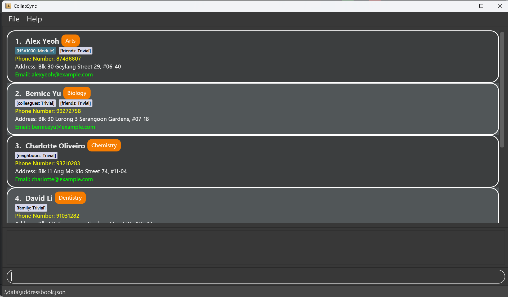
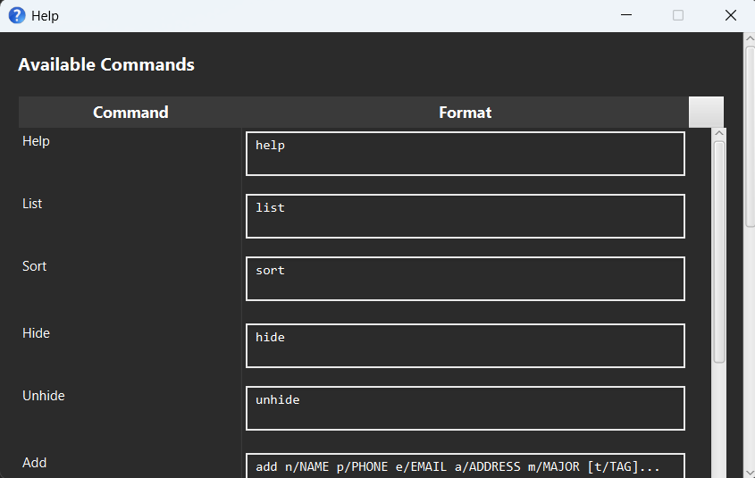
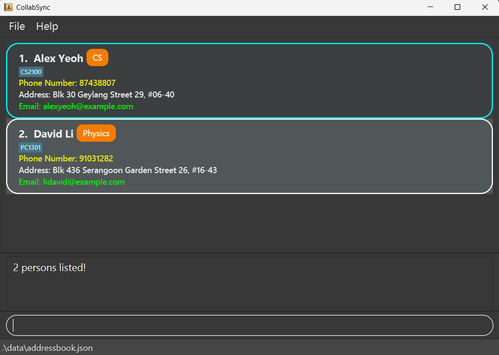

# CollabSync User Guide

CollabSync is a **desktop app for managing contacts, optimized for use via a  Line Interface** (CLI) while still having the benefits of a Graphical User Interface (GUI). If you can type fast, CollabSync can get your contact management tasks done faster than traditional GUI apps.

<!-- * Table of Contents -->
## Quick Search
1. [Quick Start](#Quick-start)
2. [Features](#features)
   - [Help](#feature-1--help)
   - [Adding a person](#feature-2--add)
   - [Listing all persons](#feature-3--list)
   - [Editing a person](#feature-4--edit)
   - [Finding persons by name](#feature-5--find)
   - [Deleting a person](#feature-6--delete)
   - [Clearing all entries](#feature-7--clear)
   - [Exiting the program](#feature-8--exit)
3. [FAQ](#faq)
4. [Known Issues](#Known-Issues)
5. [Command Summary](#Command-Summary)

--------------------------------------------------------------------------------------------------------------------

## Quick start

1. Ensure you have Java `17` or above installed in your Computer. 
   To check, click [here](#FAQ). 
   **Mac users:** Ensure you have the precise JDK version prescribed [here](https://se-education.org/guides/tutorials/javaInstallationMac.html).

1. Download the latest `.jar` file from [here](https://github.com/AY2425S2-CS2103T-F10-3/tp/releases/tag/v1.3).

1. Copy the file to the folder you want to use as the _home folder_ for your CollabSync.

1. Open a command terminal, `cd` into the folder you put the jar file in, and use the `java -jar CollabSync.jar` command to run the application. 
   A GUI similar to the below should appear in a few seconds. Note how the app contains some sample data. 
   

1. Type the command in the command box and press Enter to execute it. e.g. typing **`help`** and pressing Enter will open the help window. 
   Some example commands you can try:

    * `list` : Lists all contacts.

    * `add n/John Doe p/98765432 e/johnd@example.com a/John street, block 123, #01-01 y/2024` : Adds a contact named `John Doe` to the Address Book.

    * `delete 3` : Deletes the 3rd contact shown in the current list.

    * `clear` : Deletes all contacts.

    * `exit` : Exits the app.

1. Refer to the [Features](#features) below for details of each command.

--------------------------------------------------------------------------------------------------------------------

# Features

<box type="info" seamless>

**Notes about the command format:** 

* Words in `UPPER_CASE` are the parameters to be supplied by the user. 
  e.g. in `add n/NAME`, `NAME` is a parameter which can be used as `add n/John Doe`.

* Items in square brackets are optional. 
  e.g `n/NAME [t/TAG]` can be used as `n/John Doe t/friend` or as `n/John Doe`.

* Items with `…`​ after them can be used multiple times including zero times. 
  e.g. `[t/TAG]…​` can be used as ` ` (i.e. 0 times), `t/friend`, `t/friend t/family` etc.

* Parameters can be in any order. 
  e.g. if the command specifies `n/NAME p/PHONE_NUMBER`, `p/PHONE_NUMBER n/NAME` is also acceptable.

* Extraneous parameters for commands that do not take in parameters (such as `help`, `list`, `exit` and `clear`) will be ignored. 
  e.g. if the command specifies `help 123`, it will be interpreted as `help`.

* If you are using a PDF version of this document, be careful when copying and pasting commands that span multiple lines as space characters surrounding line-breaks may be omitted when copied over to the application.
  </box>

-----------------------------------------------------------------------------------------------------------------------

# Feature #1 : `help`
## `help` : Shows a help window
### Format: `help`

* Shows a help window with the basic commands needed for basic usage of CollabSync.  
* Also contains a message explaining how to access the help page.

-----------------------------------------------------------------------------------------------------------------------

# Feature #2 : `add`
## `add` : Adds a person to the address book.
### Format: `add n/NAME p/PHONE_NUMBER e/EMAIL a/ADDRESS y/YEARNUMBER [t/TAG]…​`

<box type="tip" seamless>

**Tip:** A person can have any number of tags (You can choose to omit tags)
</box>

### Examples:
* `add n/John Doe p/98765432 e/johnd@example.com a/John street, block 123, #01-01 y/2022 t/CS2103T`
* `add n/Betsy Crowe t/CS2100 e/betsycrowe@example.com a/Newgate Prison p/1234567 y/2023 t/MA1521`

-----------------------------------------------------------------------------------------------------------------------

# Feature #3 : `list`
## `list` : Shows a list of all persons in the address book.
### Format: `list`

<box type="note" seamless>

**Note:** You do not need to enter anything else behind `list`
</box>

-----------------------------------------------------------------------------------------------------------------------

# Feature #4 : `edit`
## `edit` : Edits an existing person in the address book.
### Format: `edit INDEX [n/NAME] [p/PHONE] [e/EMAIL] [a/ADDRESS] [y/YEARNUMBER] [t/TAG]…​`

* Edits the person at the specified `INDEX`. The index refers to the index number shown in the displayed person list. The index **must be a positive integer** 1, 2, 3, …​
* At least one of the optional fields must be provided.
* Existing values will be updated to the input values.
* When editing tags, the existing tags of the person will be removed i.e adding of tags is not cumulative.
* You can remove all the person’s tags by typing `t/` without
  specifying any tags after it.

### Examples:
*  `edit 1 p/91234567 e/johndoe@example.com` Edits the phone number and email address of the 1st person to be `91234567` and `johndoe@example.com` respectively.
*  `edit 2 n/Betsy Crower t/` Edits the name of the 2nd person to be `Betsy Crower` and clears all existing tags.

-----------------------------------------------------------------------------------------------------------------------

# Feature #5 : `find`
## `find` : Finds persons whose names contain any of the given keywords.
### Format: `find KEYWORD [MORE_KEYWORDS]`

* The search is case-insensitive. e.g `hans` will match `Hans`
* The order of the keywords does not matter. e.g. `Hans Bo` will match `Bo Hans`
* Only the name is searched.
* Only full words will be matched e.g. `Han` will not match `Hans`
* Persons matching at least one keyword will be returned (i.e. `OR` search).
  e.g. `Hans Bo` will return `Hans Gruber`, `Bo Yang`
* The search can also search using other attributes, such as phone numbers and email addresses, to find a particular person.

### Examples:
* `find John` returns `john` and `John Doe`
* `find alex david` returns `Alex Yeoh`, `David Li` 
  

-----------------------------------------------------------------------------------------------------------------------

# Feature #6 : `delete`
## `delete` : Deletes the specified person from the address book.
### Format: `delete INDEX`

* Deletes the person at the specified `INDEX`.
* The index refers to the index number shown in the displayed person list.
* The index **must be a positive integer** 1, 2, 3, …​

### Examples:
* `list` followed by `delete 2` deletes the 2nd person in the address book.
* `find Betsy` followed by `delete 1` deletes the 1st person in the results of the `find` command.

-----------------------------------------------------------------------------------------------------------------------

# Feature #7 : `clear`
## `clear` : Clears all entries from the address book.
### Format: `clear`

-----------------------------------------------------------------------------------------------------------------------

# Feature #8 : `exit`
## `exit` : Exits the program.
### Format: `exit`

-----------------------------------------------------------------------------------------------------------------------

<!-- tbc -->

### Saving the data

CollabSync data are saved in the hard disk automatically after any command that changes the data. There is no need to save manually.

### Editing the data file

CollabSync data are saved automatically as a JSON file `[JAR file location]/data/CollabSync.json`. Advanced users are welcome to update data directly by editing that data file.

<box type="warning" seamless>

**Caution:**
If your changes to the data file makes its format invalid, CollabSync will discard all data and start with an empty data file at the next run.  Hence, it is recommended to take a backup of the file before editing it. 
Furthermore, certain edits can cause the CollabSync to behave in unexpected ways (e.g., if a value entered is outside the acceptable range). Therefore, edit the data file only if you are confident that you can update it correctly.
</box>

### Archiving data files `[coming in v2.0]`

_Details coming soon ..._

--------------------------------------------------------------------------------------------------------------------

## FAQ

--------------------------------------------------------------------------------------------------------------------

## Known Issues

1. **When using multiple screens**, if you move the application to a secondary screen, and later switch to using only the primary screen, the GUI will open off-screen. The remedy is to delete the `preferences.json` file created by the application before running the application again.
2. **If you minimize the Help Window** and then run the `help` command (or use the `Help` menu, or the keyboard shortcut `F1`) again, the original Help Window will remain minimized, and no new Help Window will appear. The remedy is to manually restore the minimized Help Window.

--------------------------------------------------------------------------------------------------------------------

## Command Summary

Action     | Format, Examples
-----------|----------------------------------------------------------------------------------------------------------------------------------------------------------------------
**Add**    | `add n/NAME p/PHONE_NUMBER e/EMAIL a/ADDRESS [t/TAG]…​`   e.g., `add n/James Ho p/22224444 e/jamesho@example.com a/123, Clementi Rd, 1234665 t/friend t/colleague`
**Clear**  | `clear`
**Delete** | `delete INDEX`  e.g., `delete 3`
**Edit**   | `edit INDEX [n/NAME] [p/PHONE_NUMBER] [e/EMAIL] [a/ADDRESS] [y/YEARNUMBER] [t/TAG]…​`  e.g.,`edit 2 n/James Lee e/jameslee@example.com`
**Find**   | `find KEYWORD [MORE_KEYWORDS]`  e.g., `find James Jake tyrone@example.com`
**List**   | `list`
**Help**   | `help`
**Exit**   | `terminate and exit the program`
